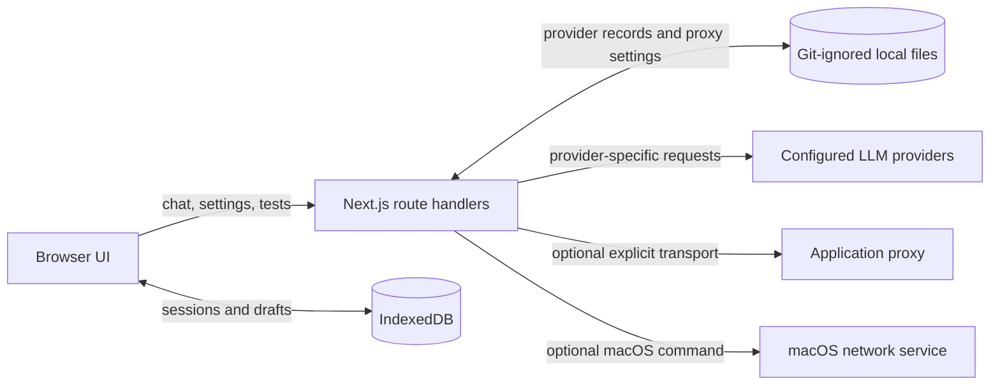

# Architecture

## Scope

Signal is a local-first, single-user AI chat workspace. It has no authentication, cloud synchronization, or server-side user database. The Next.js server is the credential boundary for UI-managed provider keys.

## Main modules

| Module | Responsibility |
| --- | --- |
| `src/app/page.tsx` | Chat sessions, model selection, streaming UI state, composer, and error panel. |
| `src/features/chat/storage.ts` | Browser IndexedDB persistence for sessions, active session, sidebar state, and drafts. |
| `src/features/chat/runtime.ts` | Provider registry, key-safe summaries, atomic local persistence, provider request helpers, connection tests, and application proxy transport. |
| `src/features/chat/provider-settings.tsx` | Connection creation, testing, editing, and per-provider non-secret drafts. |
| `src/features/chat/provider-drafts.ts` | Versioned provider draft defaults and migration of the former shared draft. |
| `src/features/chat/proxy-settings.tsx` | Application and macOS proxy controls. |
| `src/features/chat/system-proxy.ts` | macOS `networksetup` integration behind validated local route handlers. |
| `src/features/chat/markdown-message.tsx` | Safe GitHub-flavored Markdown and copyable fenced-code rendering. |

## Persistence boundaries

| Data | Location | Contains secrets? | Lifecycle |
| --- | --- | --- | --- |
| Chat sessions, drafts, selected session, sidebar state | Browser IndexedDB | No provider key | Per browser profile. |
| Provider connections | Git-ignored local server file | Yes | Written atomically with owner-only file permissions. |
| Proxy settings | Git-ignored local server file | No | Independent of provider records. |
| Provider form drafts | Browser local storage | No key | Separate draft for each provider type. |

Provider summaries returned to the browser exclude the API key. Provider requests and test calls resolve keys only on the server.

## Provider adapter seam

The public provider model is represented by `ProviderKind`, `ProviderSummary`, and `ModelOption`. Every model selector ID contains the provider record ID and model/deployment name, which prevents a model from silently moving to another connection.

The chat route selects a protocol branch per provider kind. Azure uses a resource/deployment route and API-key header; compatible endpoints use Chat Completions; OpenAI Responses uses its event stream; Gemini and Anthropic use their own streaming event shapes. Modern completion limits are attempted first, with a compatibility retry only when an endpoint explicitly rejects the modern parameter.

## Safety and diagnostics

- Raw Markdown HTML is not rendered.
- Remote model images are not auto-fetched by the renderer.
- Provider error text is compacted and redacts common credential header patterns before display.
- Local onboarding content is marked local-only and is never sent to a model.
- System proxy changes are macOS-only, validated against known network services, and require an explicit UI confirmation.

## Extension points and gaps

The current implementation is intentionally local and single-user. A hosted version should replace file-based keys with a server-side secret manager, add authentication and authorization before exposing settings routes, and move session persistence to a synchronized store. Additional provider types should add an explicit `ProviderKind` branch plus matching test and streaming parsing behavior.
