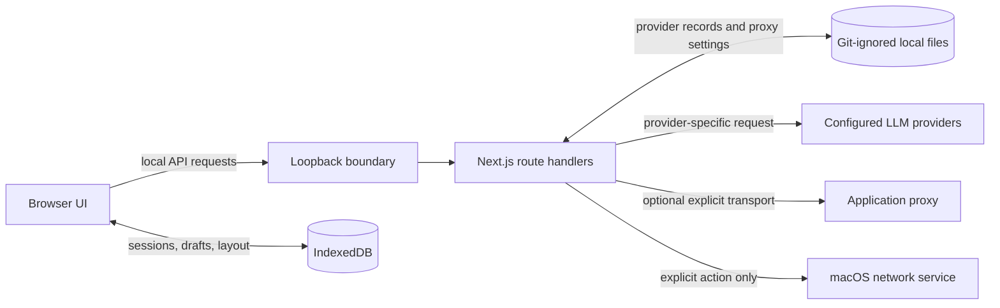

# Architecture

## System at a glance

Signal is a local-first, single-user AI chat workspace. The UI runs in a browser, while a local Next.js server holds UI-managed provider keys and sends provider requests. There is no login, cloud database, synchronization service, or hosted deployment mode.



The server starts on `127.0.0.1`. Route handlers also reject requests whose host, origin, or forwarded address is not loopback. This defense in depth protects the local credential and system-proxy boundary from accidental network exposure.

## Key modules

| Module | Responsibility |
| --- | --- |
| `src/app/page.tsx` | Session selection, model selection, composer, streaming UI, and safe error presentation. |
| `src/features/chat/storage.ts` | Browser IndexedDB persistence for sessions, drafts, selected session, and sidebar state. |
| `src/features/chat/stream-registry.ts` | Owns active abort controllers by session so concurrent streams cannot overwrite one another. |
| `src/features/chat/runtime.ts` | Provider registry, key-safe summaries, atomic local persistence, request helpers, connection tests, and application-proxy transport. |
| `src/features/chat/provider-settings.tsx` | Connection creation, testing, editing, and per-provider non-secret drafts. |
| `src/features/chat/provider-drafts.ts` | Versioned provider draft defaults and migration of the former shared draft. |
| `src/features/chat/proxy-settings.tsx` | Application and macOS proxy controls. |
| `src/features/chat/system-proxy.ts` | macOS `networksetup` integration behind loopback-only route handlers. |
| `src/features/chat/local-access.ts` | Shared local-request guard used by every API route. |
| `src/features/chat/markdown-message.tsx` | Safe GitHub-flavored Markdown and copyable fenced-code rendering. |

## Data ownership and persistence

| Data | Owner and location | Secret? | Behavior |
| --- | --- | --- | --- |
| Sessions, messages, drafts, selected session, sidebar state | Browser IndexedDB | No provider key | Persists for the current browser profile; clearing browser data removes it. |
| Provider connections | Git-ignored `data/providers.json` on the local server | Yes | Written atomically with owner-only file permissions; API responses omit keys. |
| Application proxy setting | Git-ignored `data/proxy.json` on the local server | No | Persists independently from provider connections. |
| Provider-form drafts | Browser local storage | No key | One non-secret draft per provider type. |

Provider requests and tests resolve API keys on the server only. The browser receives `ProviderSummary` and `ModelOption` values, which intentionally omit keys. A model picker ID contains the provider record ID plus its model/deployment name, preventing a model from silently moving to another connection.

## Request and streaming flow

```mermaid
sequenceDiagram
  participant U as User
  participant B as Browser session
  participant R as Local route
  participant P as Provider
  U->>B: Send message
  B->>B: Persist user message and streaming placeholder
  B->>R: POST /api/chat (chosen model + messages)
  R->>R: Enforce loopback; resolve saved connection
  R->>P: Send protocol-specific streaming request
  P-->>R: Provider events
  R-->>B: UTF-8 text stream
  B->>B: Update only the owning session
```

`StreamRegistry` gives every session its own abort controller. A response may keep streaming if the user opens another session; returning to the original session exposes its own Stop control. Releasing a completed stream only removes the controller it created, so it cannot clear a newer request.

## Provider adapter seam

`ProviderKind`, `ProviderSummary`, and `ModelOption` define the public provider model. The chat route selects a protocol branch per provider kind:

- compatible endpoints use Chat Completions;
- OpenAI endpoints use the Responses event stream;
- Azure uses resource/deployment routing and an API-key header;
- Gemini and Anthropic use their native request and streaming shapes.

Compatible and Azure requests send `max_completion_tokens` first, then retry with `max_tokens` only when an endpoint explicitly reports that the modern parameter is unsupported. New provider families should add a `ProviderKind`, an explicit route branch, parsing coverage, and connection-test coverage rather than reusing an incompatible protocol.

## Safety decisions

- Raw Markdown HTML is not rendered; remote model images are not fetched automatically.
- Provider error text is compacted and redacts common credential header patterns before display.
- Local onboarding content is marked local-only and is never sent to a model.
- System proxy changes are macOS-only, restricted to known services, and require explicit UI confirmation.
- Every browser-to-server route is loopback-only. This is not a substitute for authentication in a hosted design.

## Deliberate extension boundaries

A hosted or multi-user version needs a different security model: authenticated users, authorization for settings and provider use, rate limits, audited secret storage, server-side session persistence, and an explicit remote deployment posture. Agent workflows, file tools, and cloud sync should be added as separate product capabilities rather than assumed by the chat runtime.
