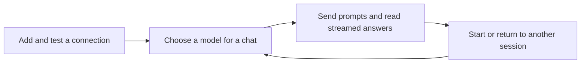

# Product concept

## The problem

People who use more than one AI model often lose context while moving between browser tabs, provider consoles, temporary prompts, and half-finished drafts. The choice of provider, endpoint, and model can be as important as the prompt, yet that configuration should not crowd out the conversation itself.

Signal gives a single person a dependable local place to think with AI: conversations stay distinct, model choices are explicit, and connection management is available when needed rather than always in the way.

## Product promise

**A conversation stays yours until you deliberately change it.** Starting a new chat does not overwrite prior chats. Switching sessions preserves every session’s selected model, messages, and draft. Switching a model is a visible, per-session action.

## Design principles

| Principle | Product behavior |
| --- | --- |
| Calm by default | The composer and current conversation are central; all configuration sits in one focused Settings Hub. |
| Explicit model choice | Every session has an exact saved connection/model pair rather than an ambiguous provider default. |
| Local ownership | Browser data stays in the browser; provider keys remain on the local server. |
| Test before trust | Connections can be tested before saving, with safe diagnostics when a provider rejects a request. |
| Safe rendering | Model output supports useful Markdown while raw HTML and automatic remote images are not rendered. |
| Reversible attention | A streaming response can be stopped from the session that owns it, even while another session is open. |

## Core workflow

The first connection is the only required setup. Once it is saved, creating a fresh chat is lightweight: it starts with the active model and an empty context. Existing chats continue to use their own selected models.

## Current boundaries

Signal is a local, single-user client. It is not designed for:

- shared accounts, roles, organization workspaces, or collaboration;
- cloud backup or synchronization between browsers and computers;
- public hosting, remote access, or a multi-tenant API;
- autonomous agent execution, file-tool execution, provider-side binary attachment delivery, or background workflows. Files can be stored privately with a message, while the tool policy remains a configuration seam rather than a runtime capability.

Those capabilities would require a new security and persistence model—not merely UI additions. See [Architecture](ARCHITECTURE.md) for the current trust boundaries and extension points.
